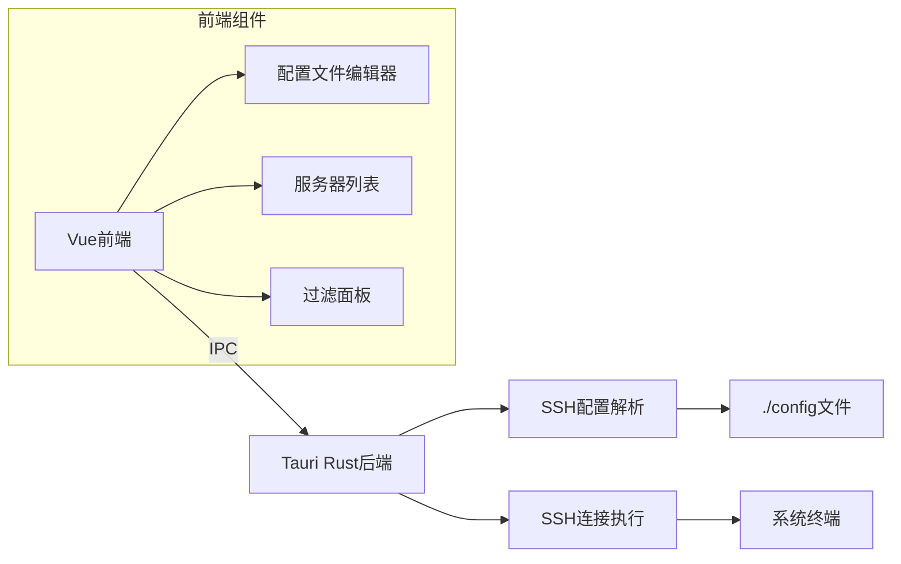

# SSH配置管理工具GUI开发计划

## 项目概述
为现有SSH配置管理工具开发基于Tauri 2.0的GUI界面，使用Vue 3.0前端框架。保留现有CLI功能作为主要使用入口，GUI专注于配置文件编辑和管理。

## 技术栈
- **后端**: Tauri 2.0 + Rust
- **前端**: Vue 3.0 + TypeScript + Pinia
- **通信**: Tauri IPC
- **UI组件库**: PrimeVue（可选）

## 架构设计


## 功能模块

### 1. 配置文件编辑器
- 语法高亮显示SSH配置
- 实时错误检测
- 保存/另存为功能
- 支持导入/导出

### 2. 服务器列表展示
- 表格形式展示解析后的服务器配置
- 显示主机名、用户、端口、分组和标签
- 只读模式（连接操作仍通过CLI）

### 3. 分组/标签管理
- 侧边栏过滤面板
- 按分组/标签动态筛选
- 自定义标签管理

### 4. 系统集成
- 默认读取`./config`文件
- 执行SSH连接命令（调用系统终端）
- 配置文件变更通知

## 实施步骤

### 阶段1：项目初始化
1. 添加Tauri依赖到`Cargo.toml`
2. 创建前端目录：`web/`
3. 初始化Vue 3.0项目
4. 配置Tauri绑定路径：`src-tauri/`

### 阶段2：核心逻辑重构
1. 创建`src/lib.rs`：
   ```rust
   pub fn parse_ssh_config(path: &Path) -> Result<Vec<ServerConfig>> { ... }
   pub fn connect_to_server(host: &str) -> Result<()> { ... }
   ```
2. 创建Tauri命令：
   ```rust
   #[tauri::command]
   fn get_servers() -> Vec<ServerConfig> {
       parse_ssh_config(Path::new("./config")).unwrap_or_default()
   }
   ```

### 阶段3：前端开发
1. 创建核心组件：
   - `ConfigEditor.vue`：带语法高亮的编辑器
   - `ServerListView.vue`：服务器表格展示
   - `FilterPanel.vue`：分组/标签过滤器
2. 实现状态管理（Pinia）
3. 配置Tauri IPC通信

### 阶段4：系统集成
1. 实现配置文件读写接口
2. 添加SSH连接按钮（调用系统终端）
3. 实现配置文件监控（可选）

### 阶段5：测试与优化
1. 单元测试：Rust配置解析逻辑
2. 集成测试：GUI操作流程
3. 真实环境测试：使用`./config`验证功能
4. 性能优化：大型配置文件处理

## 文件结构变更
```
ssh-config-enhance-rs/
├── src/
│   ├── main.rs         # CLI入口（保留）
│   ├── lib.rs          # 共享逻辑
│   └── tauri_commands.rs # Tauri IPC
├── web/                # Vue前端
│   ├── src/
│   │   ├── components/
│   │   │   ├── ConfigEditor.vue
│   │   │   ├── ServerListView.vue
│   │   │   └── FilterPanel.vue
│   │   ├── stores/
│   │   │   └── configStore.ts
│   │   └── App.vue
│   └── package.json
├── src-tauri/          # Tauri配置
├── config              # SSH配置文件
└── GUI_DEVELOPMENT_PLAN.md # 本计划
```

## 后续行动
1. 切换到Code模式进行开发
2. 初始化Tauri项目结构
3. 实现核心逻辑重构